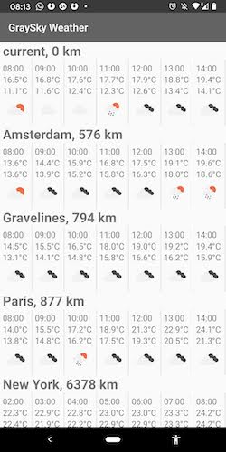

# Gray Sky
☀️ The app that makes your mood affect the weather.

## ☀️ About
Gray Sky Weather is the app to compare the closest locations weather on the same timeline.
Talking about the weather can be used as an ice-breaker with a stranger or in difficult situations (ex: a job interview).

At first, this project is part of the interview process at [Shadow](https://shadow.tech) and the initial inspirations come from [Sunly](https://github.com/carayolthomas/Sunly-Objc)

The name Gray Sky is after [Dark Sky got bought by Apple](https://blog.darksky.net/).
Of course, I am still hoping to join the [Shadow](https://shadow.tech) 💻.

I plan to publish on the Google Play store and improve the project.

## 🏘️ Architecture
I use **MVVM**, which is de facto Clean Architecture promoted by Google.

Each location weather forecast is self-contained in a fragment `WeatherForecastFragment`. This Fragment requests its data( weather forecast and reverse geocoding).
If the weather forecast were constantly updated, the references to this Fragment would be kept at the parent level(`MainActivity`) to coordinate.

The coroutines/LiveData are a good replacement for RxJava's SingleObserver.

## 🕵️‍ How to run

Clone this project
>git clone https://github.com/raychenon/gray-sky-weather.git

Open in [Android Studio](https://developer.android.com/studio) the file `build.gradle` (the one at root folder).

Build & Run 🔥

## 🕵️‍ How to test 
All the locations are hardcoded in `GlobalConstants.CITIES`.

You can change the latitude and longitude of the `GlobalConstants.USER_LOCATION`.

## 🦁 TODO
 - add the feature "user's current geolocation". It needs an user flow(permission accepted, permission denied)
 - Unit testing
 - UI testing
 - nice animations (ex: Lottie)

## 🙏 Acknowledgements & Special thanks
The weather data and icons come from [openweathermap.org](https://openweathermap.org/)

## 🎁 Licence
This app is released under the [Apache License 2.0](https://github.com/raychenon/gray-sky-weather/blob/master/LICENSE).

You can read [the terms of Apache License 2.0 in simple English](https://tldrlegal.com/license/apache-license-2.0-(apache-2.0))